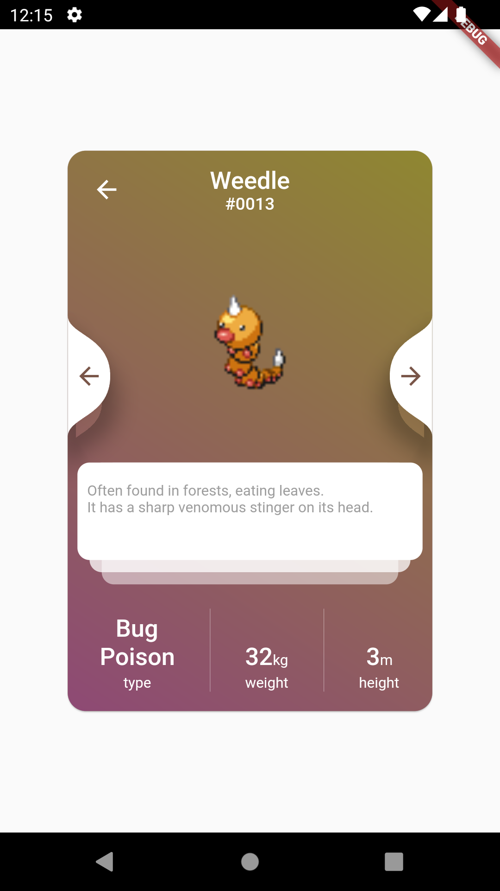

# Pokedex

## User Story
- [x] see a list of all Pokémon
- [x] be able to navigate to a detail screen of a Pokémon that features relevant information

## Acceptance criteria
- Pokémon list page
  - [x] show name
  - [x] show image
  - [x] Tapping on a Pokémon should navigate to the detail page
- Pokémon detail page
  - [x] Display name, image and type of the tapped Pokémon

## Technical requirements
- [x] use [PokéAPI](https://pokeapi.co/)

## Screenshots
### Overview

 

 

### Details

 

 

## Attribution
- [Pokemon Type Icons](https://commons.wikimedia.org/wiki/Category:Pok%C3%A9mon_types_icons) by [Andreuvv](https://commons.wikimedia.org/wiki/User:Andreuvv)

## Inspired by
- [Chira Chirakija](https://dribbble.com/shots/14184018-Pok-dex-App-V-2)
- [Mauro E. Wernly](https://dribbble.com/shots/6175056-Pok-dex)
- [ttya](https://dribbble.com/shots/2978201-pokemon-Go)
- [hungps](https://github.com/hungps/flutter_pokedex)